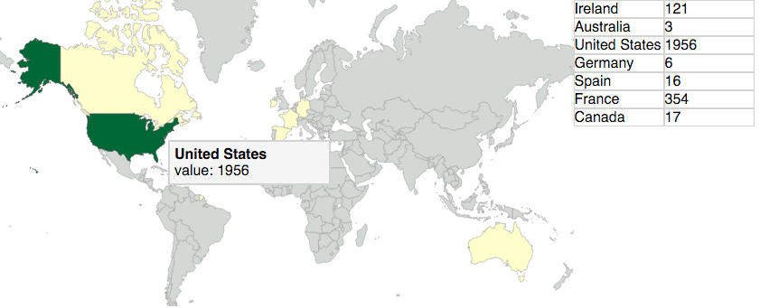
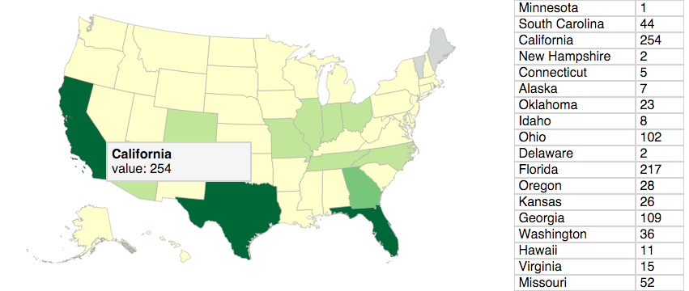
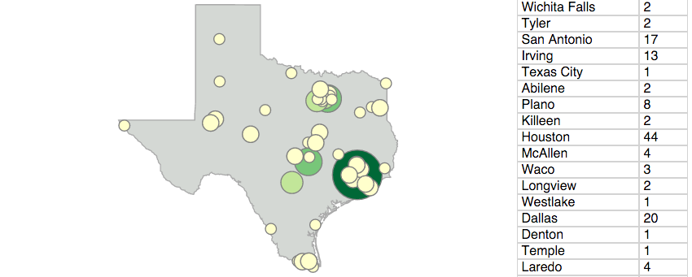

# Choropleth 

> Choropleth aspires to be a javascript library for quickly and easily creating interactive choropleth maps using D3. All it will require is access to an endpoint to query location data. 

> The library also allows you to sync data between other visualizations - clicking a country on the map will show you data for the states of that country, but you can trivially show that same data in an accompanying table or chart through the onClick callback. You can even bring your own CSS or use ours! 

World View:


Country View:


State View:


### Usage
> Getting started with choropleth is easy!

> **Step 1: Load dependencies**
```html
<script src="d3.min.js"></script>
<script src="topojson.min.js"></script>
<script src="choropleth.js"></script>
```
> **Step 2: Make topojson files publicly available**

> Just copy the [public/geodata](public/geodata) directory from this project into your site's public folder. You can change where Choropleth will look for these files in the `filepath` config passed to the Choropleth instance.

> **Step 3: Place a div on the page**
```html
<body>
  <div id="map"></div>
</body>
```
> **Step 4: Create new Choropleth instance**
```js
var dataObj = {};
var choropleth = new Choropleth({
  mapSelector: 'map',
  dataStore: dataObj, 
  loadingHTML: '<span>Loading!</span>',
  onClick: function(selection){
    var info = this.get(selection);
    if(info){
      this.render(selection);
      updateTable(info);
    } else {
      // ajax request
      // this.insert(ajaxResponse, selection);
      // this.render(selection);
    };
  }
});
```

> For a more detailed example, check out [public/index.html](public/index.html)

### Current status: alpha
> I have a rough cut finished, but there are still features to add and fairly major bugs to fix. I'd also like to refactor the whole thing in ES6 and Webpack, and maybe release it on npm. Overall, I'd say it's about 70% to beta. 